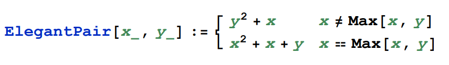
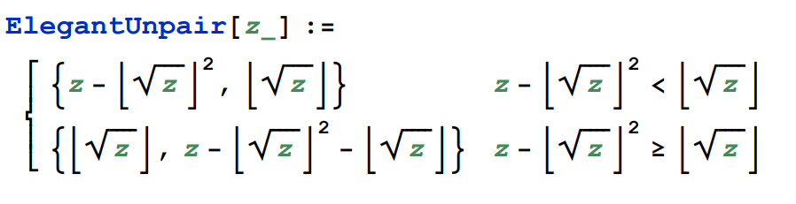
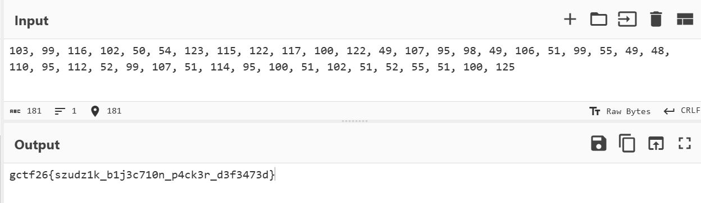

# The Szudzik Dropper - GCTF 2026
Solved by `adrianchx`
## Introduction
The Szudzik Dropper is a cryptography challenge based on a mathematical problem, specifically **Multidimensional Pairing Functions (recursive Szudzik)**.

Files included with the challenge are `dropper.py` and `output.txt`.

---
## The Solve
First thing I'd usually do is **search up** any unfamiliar words in the challenge, which in this case would be **Szudzik**.

In short, Szudzik is a mathematical pairing function to uniquely encode two natural numbers into a single natural number.



`dropper.py`
```py
import sys

sys.set_int_max_str_digits(100000)

def szudzik_pack(x, y):
    if x >= y:
        return x * x + x + y
    else:
        return y * y + x

def obfuscate_payload(data):
    length = len(data)
    if length == 1:
        return data[0]
    elif length == 2:
        return szudzik_pack(data[0], data[1])
    
    mid = length // 2
    return szudzik_pack(obfuscate_payload(data[:mid]), obfuscate_payload(data[mid:]))

if __name__ == "__main__":
    with open("output.txt", "rb") as f:
        flag = list(f.read().strip())
    
    signature = obfuscate_payload(flag)
    print("Obfuscated payload signature:")
    print(signature)
```
\
`output.txt`
```
Obfuscated payload signature:
195390014645616526811445087179505427788741973674457235287782954449193768603971718690010617438712386268024827135724473740960104005201143
```

\
A quick look at the encryption code provided tells us this is a **recursive** case of the Szudzik function, and our goal here is to simply decrypt the obfuscated payload here back into flag.

> A deeper analysis of what's happening here is that we're taking the flag, split it into halves recursively (giving us a *binary tree*) until we reach one singular character at the end, then pair up the halves into one long int as in `output.txt`. 

Luckily, the inverse of the Szudzik is also easily found with the formula available, so all we have to do is run the **inverse** formula with recursion applied to get the flag.



\
However, I had missed a small detail initially which made me fail to get the decoding program to work at first:
```py
with open("output.txt", "rb") as f:
    flag = list(f.read().strip())
```
Here, the file is opened as binary, so `f.read()` returns a `bytes` object and not `str`. The charcters of the flag gets converted into ASCII decimal equivalent (bytes). 

For example, character `g` gets read as `103` via `"rb" (read binary)` mode. (This also allows the recursion for the encoding part to exactly stop at single characters)

Thus, we have to add `if data < 256:` as the base case into the decoding script so that the recursion knows to stop when the `int` value reaches below the size for one ASCII character (exactly one character).

---
The script I used to solve (basically just took the original script and modified it):  

`undropper.py`
```py
import sys
import math

sys.set_int_max_str_digits(100000)

def szudzik_unpack(z):
    z=int(z)
    s = math.isqrt(z)
    sq = s*s
    if (z - sq) < s:
        # formula for inverse, you can look it up for a more in depth explanation
        return z - sq, s
    else:
        return s, z - sq - s

def unobfuscate_payload(data):
    if data < 256: #ascii decimal max
        return [data] #return as list so it doesnt get added like normal int

    left, right = szudzik_unpack(data)
    return unobfuscate_payload(left) + unobfuscate_payload(right)

if __name__ == "__main__":
    # yeah was lazy i just took the coded flag and put it here xd
    flag = 195390014645616526811445087179505427788741973674457235287782954449193768603971718690010617438712386268024827135724473740960104005201143
    signature = unobfuscate_payload(int(flag))
    print("unobfuscated payload signature:")
    print(signature)
```

Which gives us the **output** of:
```py
unobfuscated payload signature:
[103, 99, 116, 102, 50, 54, 123, 115, 122, 117, 100, 122, 49, 107, 95, 98, 49, 106, 51, 99, 55, 49, 48, 110, 95, 112, 52, 99, 107, 51, 114, 95, 100, 51, 102, 51, 52, 55, 51, 100, 125]
```

And when put into **CyberChef** converting from **Decimal**:



`gctf26{szudz1k_b1j3c710n_p4ck3r_d3f3473d}`