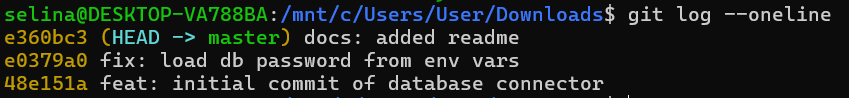
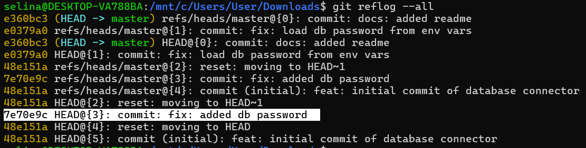
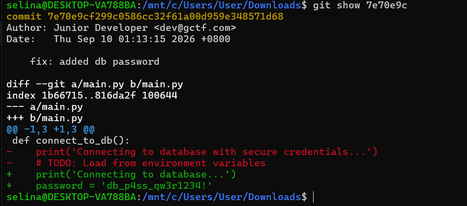

# Ghost in the Repo 1 - GCTF 2026

Solved by [`SelinaTan`](https://github.com/SelinaTan05)

## The Solve

First I first used `git log --oneline` to inspect the normal commit history, but the commit containing the password was not listed.

I then checked the Git reference log. Then I found where the db password added.

Then, inspect the removed commit named `"fix: added db password"`.

`gctf26{db_p4ss_qw3r1234!}`
