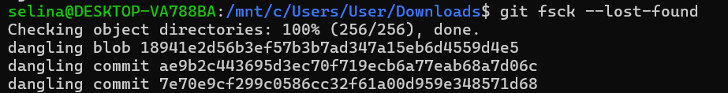
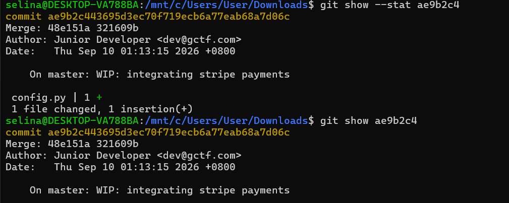
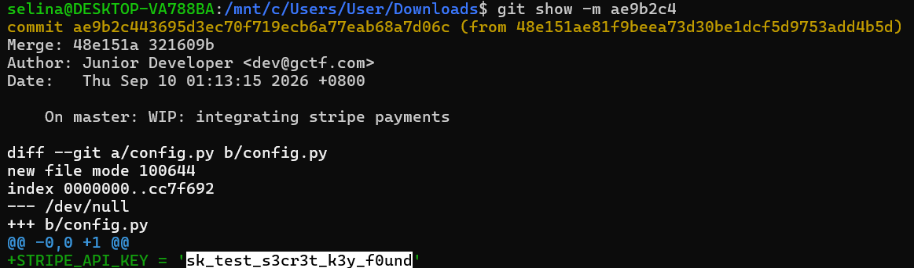

# Ghost in the Repo 2 - GCTF 2026

Solved by [`SelinaTan`](https://github.com/SelinaTan05)

## The Solve

The challenge stated that the developer temporarily saved the changes and later deleted them. Since the stash was no longer available, I searched for dangling Git objects.

The first result was only a blob, meaning it stored file content without commit information such as a message or parent history. The commit `7e70e9c` belonged to the previous database-password challenge, so I inspected the remaining commit, `ae9b2c4`.

It showed that a new file named config.py had been added. This confirmed that it was the deleted stash related to this challenge.

However, it did not display the file changes because the stash was stored as a merge commit. Therefore, I used the `-m` option to show the differences against its parents.

`gctf26{sk_test_s3cr3t_k3y_f0und}`
