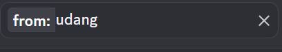
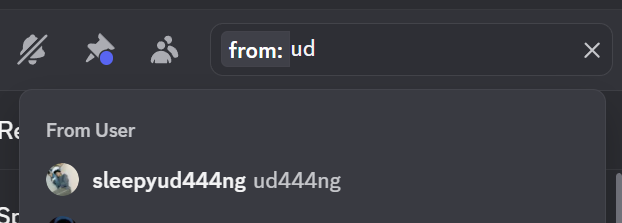
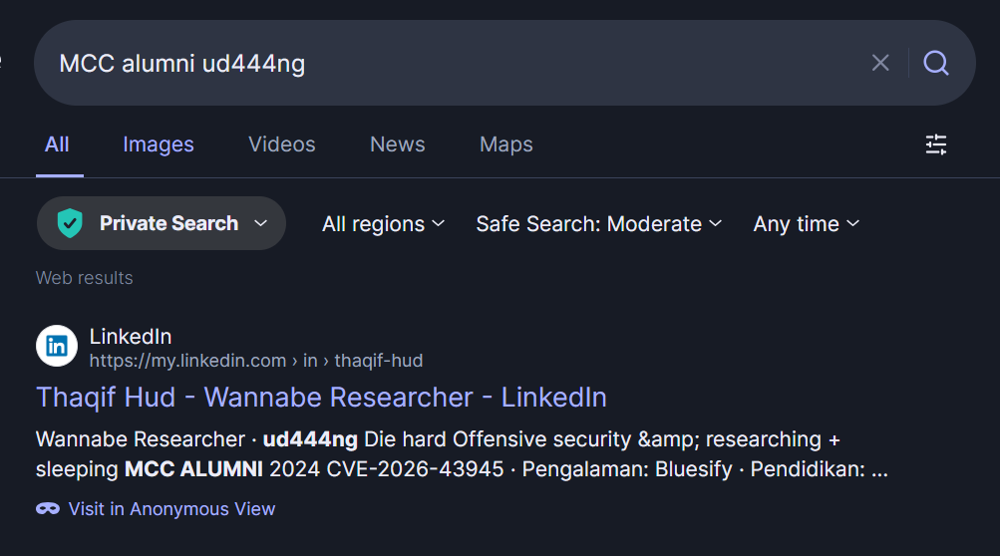
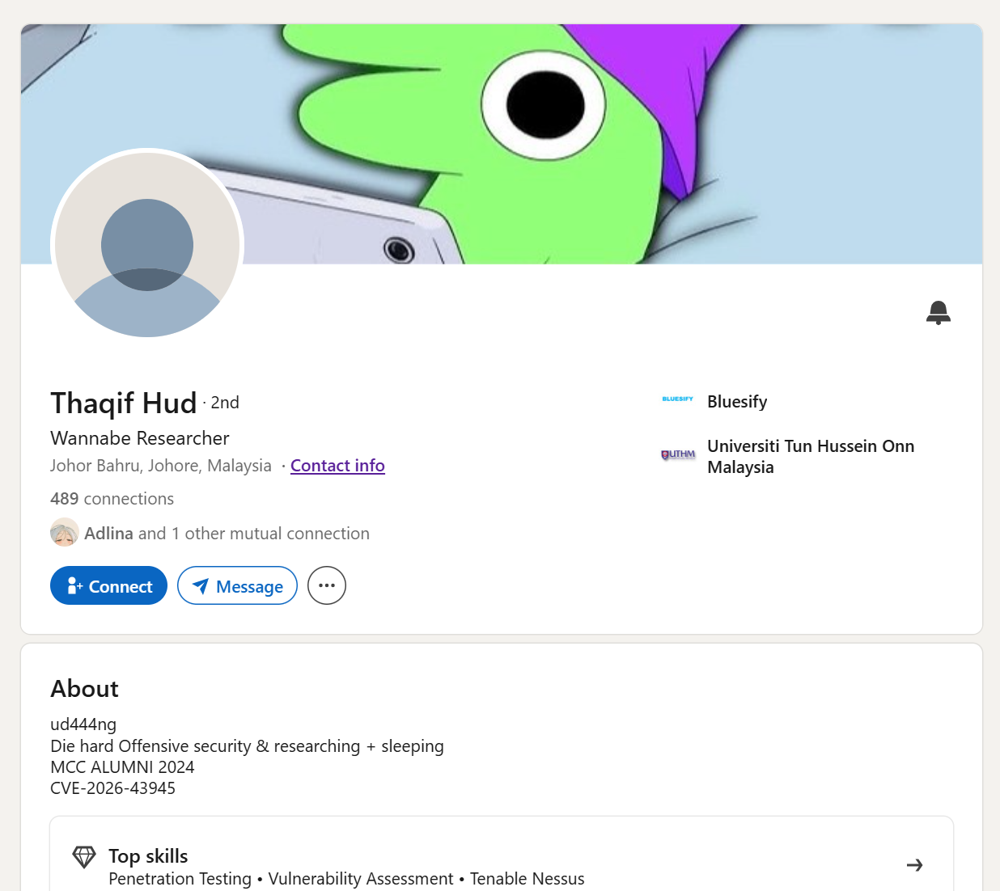

# Who dis? - GCTF 2026

Solved by `adrianchx`

## Introduction

Who dis? is a simple misc challenge with OSINT elements. In the challenge we are told that there is a person with the name `udang` in the GCTF Discord, who happens to also be an MCC alumnus. Our task is to find the LinkedIn profile URL of this person.

## The Solve

First step I did was to do a search on the usernames in the Discord to see if there was any udangs lying around.

Discord has a built function that allows you to search for a specific message based on filters set, including `messages sent from: xxx` which was what I used:

However, `udang` filter returned me no result, meaning there was no Discord user with this username.

Since this cannot be right, I went back and tried again, but this time typing the letters one by one to see if there was any users with names similar to `udang` but not exactly spelt as `udang`.

This gives us the user `ud444ng`, which in leetcode translated back is simply `udaaang`, meaning this is the person that we're looking for.

Now that we have their Discord account, we can do some recon on the public profile of this account. Since sometimes people like to display connected accounts to their discord publicly, which can give us a clue to their LinkedIn profile.

Unfortunately, `udang`'s public Discord profile only displays a linked Spotify account, that after a quick scan through gave us no clue to the actual identity of `udang`.

Since the Discord angle didn't work, I decided to go the MCC route instead.

Searching `MCC alumni` gave us a lot of results that included the other alumnus for MCC, so instead we add `ud444ng` to the search to pinpoint our guy.

`gctf{https://www.linkedin.com/in/thaqif-hud}`

