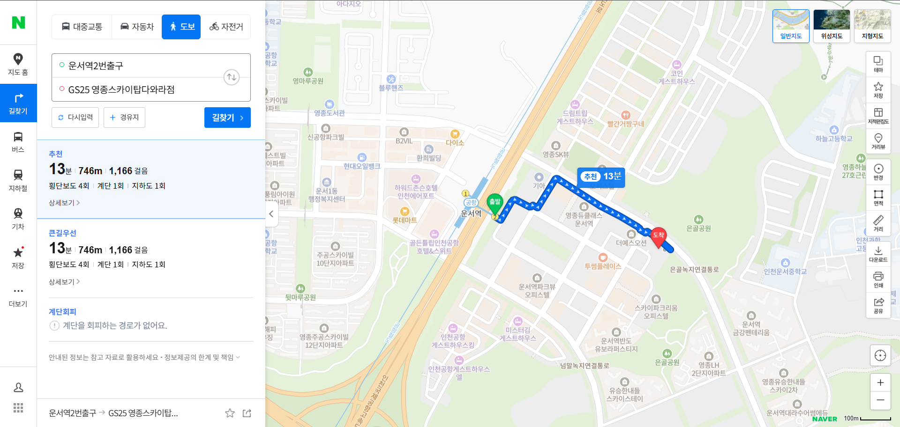
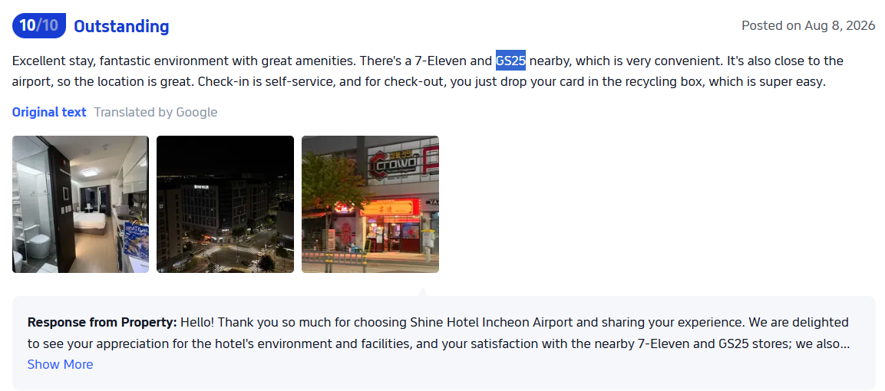

# Where am I? - GCTF 2026

Solved by [`SelinaTan`](https://github.com/SelinaTan05)

## Introduction

Where am I? is an OSINT challenge where we are tasked to find out the location of a hotel. The information given was that it was ~500m from a Station Exit 2, taking a left turn then a right turn before walking straight. Another hint revealed that there is a CU and GS25 located in the same building.

## The Solve

Just google the keyword like "CU" and "GS25" & "Exit2".

[https://in.trip.com/hotels/incheon-hotel-detail-70849230/yeongjong-shine-hotel/review.html](https://in.trip.com/hotels/incheon-hotel-detail-70849230/yeongjong-shine-hotel/review.html)  
[https://fi.trip.com/hotels/incheon-hotel-detail-70849230/shine-hotel-incheon-airport/](https://fi.trip.com/hotels/incheon-hotel-detail-70849230/shine-hotel-incheon-airport/)

Then I found MYME Hotel, Hongdae stay and Shine Hotel.
On Naver map, just check the route one by one, then this one (Shine Hotel in Sky Top) is nearest to 500m mentioned in the hint.

The submitted location as per findings is `Sky Top Building, 15-7 Yeongjong-daero 196beon-gil, Unseo-dong, Yeongjong-gu, Incheon, South Korea`. Which was confirmed correct by the challenge creator in the ticket, thus earning us the flag:

`gctf26{your_osint_so_gud}`
