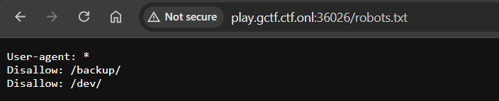
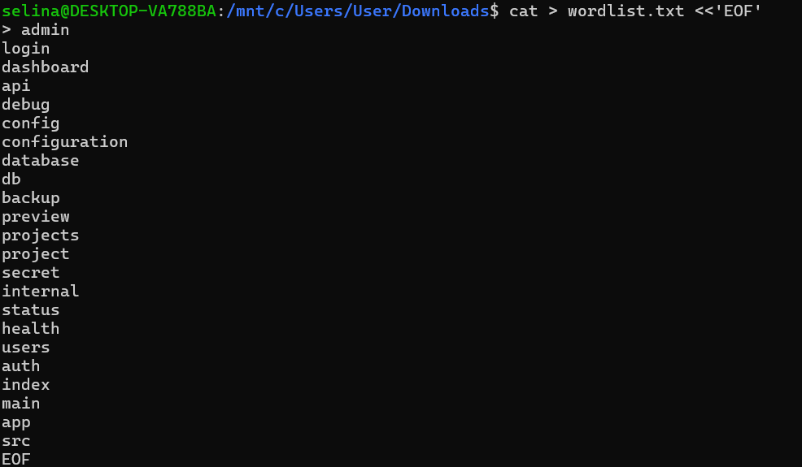
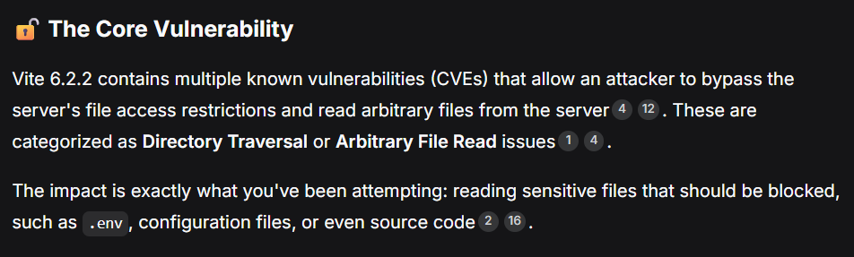
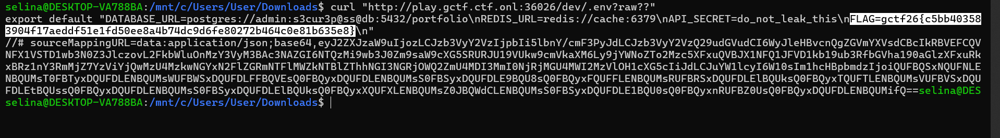

# Rough Draft - GCTF 2026
Solved by [`SelinaTan`](https://github.com/SelinaTan05)

## The Solve

First, going to `robots.txt` to find any hidden endpoints.

Found `Vite 6.2.2` configuration:

Check security issue of `Vite 6.2.2` configuration

Try reading .env file and get the flag:
`gctf26{c5bb403583904f17aeddf51e1fd50ee8a4b74dc9d6fe80272b464c0e81b635e8} `
