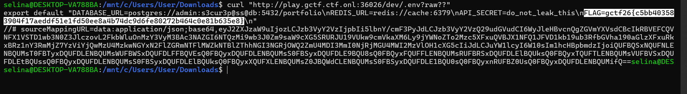

# Rough Draft - GCTF 2026

Solved by [`SelinaTan`](https://github.com/SelinaTan05)

## The Solve

The first thing I checked was robots.txt, because it often reveals directories that are not linked from the main website. It revealed two hidden paths: `/backup/` and `/dev/`. These paths were not shown on the normal website, so they became the next targets to investigate.


To enumerate possible files and routes, I created a small custom wordlist with common web paths such as `admin`, `login`, `backup`, `config`, `database`, `dev`, and `api`. The words were chosen based on common web application paths and the challenge hint about backups, databases, and development files.


After finding `/backup/` from `robots.txt`, I visited it directly. The server had directory listing enabled and exposed two files: `'config.env.bak'` & `'db_dump.sql'`

The backup config file contained database connection details:


The SQL dump contained users, projects, and API key tables. However, the passwords and API keys were stored as bcrypt hashes, so they were not directly usable.

Also, the database host was an internal IP address, so I could not connect to it directly from outside.
At this point, `/backup/`confirmed that development files were leaked, but it was not the final path to the flag.

Next, I checked the `/dev/` path.

```bash
curl -i http://play.gctf.ctf.onl:36026/dev/
```

The page showed:


The HTML also loaded Vite development scripts. This indicated that the server was exposing a Vite development environment.

I then checked for common Vite project files under `/dev/`. This confirmed that the application was using `Vite version 6.2.2`.


I also request to `.env` but was blocked and the server returned `403 Restricted`.

Since the site was running `Vite 6.2.2`, I looked into known Vite development server file access bypasses. The key idea was that Vite can serve files as raw modules using the `?raw` query parameter, and vulnerable versions could mishandle specially crafted query strings.


*This screenshot shows the research step. After discovering `Vite 6.2.2`, I checked whether this version had known file access bypass vulnerabilities. This matched the behavior needed for the challenge: reading sensitive files such as `.env`.*

The normal `.env` request was blocked, but adding the raw query bypass worked. The server returned the `.env` file as a JavaScript module.



`gctf26{c5bb403583904f17aeddf51e1fd50ee8a4b74dc9d6fe80272b464c0e81b635e8}`